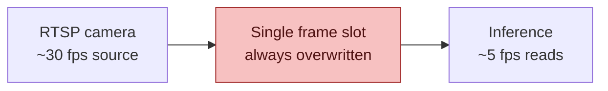
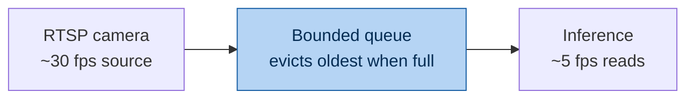
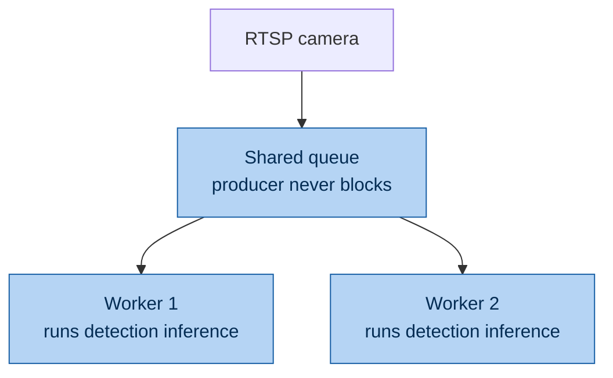

# Preventing frame loss during inference

## The core tradeoff

A camera produces frames at its own native rate; inference consumes them at whatever rate the model and hardware allow. When the consumer is sustainedly slower than the producer, you cannot simultaneously guarantee zero backlog growth and zero unevaluated frames — every fix below either accepts some loss to stay real-time, or accepts growing latency to stay complete. The right choice depends on whether "catch faces as they appear" (some loss tolerable) or "evaluate every frame" (latency tolerable) matters more for the use case.

## Where loss happens in the current design

The grabber thread never blocks on inference — it continuously drains the RTSP/FFMPEG decode buffer regardless of model speed, so there's no loss at the network or decode layer. The loss happens one level up: the shared buffer holds exactly one frame, so anything arriving between two inference reads is silently overwritten before it was ever evaluated.

If inference takes longer than the throttle's budget, nothing crashes and no backlog visibly builds up — frames just keep arriving and getting overwritten between successful inference reads, so the effective sampling rate ends up lower than the nominal target.

## Fix 1 — Bounded queue

Swap the single overwritten slot for something like `collections.deque(maxlen=N)`, which evicts the oldest entry once full instead of discarding instantly.

This buys slack against brief inference stalls — a frame arriving mid-call now waits a few cycles instead of vanishing immediately. It does not solve sustained overload: if inference is *consistently* slower than the target rate, the queue fills and starts dropping the oldest frames anyway, just with a slightly larger grace window than before.

## Fix 2 — Make inference itself faster

The structural fix rather than a buffering workaround: a smaller model variant, a lower `imgsz`, FP16/quantized weights, or exporting to ONNX/TensorRT instead of running the raw PyTorch model. Worth flagging directly: raising `imgsz` to improve recall on small/distant faces (as we did to fix the missed-face issue) pushes per-frame inference time *up*, which is exactly what creates backlog risk if the hardware can't sustain it at that resolution. These two goals pull in opposite directions — benchmark actual inference latency at the chosen `imgsz` on the target hardware before assuming either is solved.

## Fix 3 — Decouple capture from analysis, run workers in parallel

Write every captured frame into a fast shared queue immediately (a cheap operation that will basically always keep up), and let one or more independent worker processes drain that queue at whatever pace they can sustain.

This is the only approach that gives a real zero-frame-loss guarantee, since nothing is discarded before being queued for analysis. Aggregate throughput scales with worker count — a thread pool works reasonably well since Torch/Ultralytics releases the GIL during the actual matrix math, or use `multiprocessing` for guaranteed parallelism. The cost shifts from "frames silently disappear" to "analysis runs behind real time under sustained load" — losslessness is traded for latency, not eliminated as a concern entirely.

## Fix 4 — Batch frames into one forward pass

Instead of one `predict()` call per frame, accumulate 2-4 queued frames and run them through the model together. GPUs in particular are more efficient per-frame in batched mode, reclaiming some throughput without changing model size. This slots into either worker in the diagram above as an internal optimization rather than a different architecture.

## Recommendation for this pipeline

For a 5 fps face-capture setup where the goal is "catch faces as they appear" rather than exhaustive frame-by-frame analysis: start with the bounded-queue swap (Fix 1), since it's a small change to existing code. Then actually measure inference latency at `imgsz=1280` before reaching for parallel workers — there's a good chance the queue alone closes most of the gap if stalls are occasional rather than sustained. Only move to Fix 3 (parallel workers) if benchmarking shows inference is *consistently* slower than the target rate rather than just occasionally spiking.
